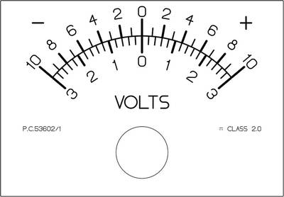

# Meterdraw

*Version 0.85*

Meterdraw is a Python program to create scale cards for analog meter movements.

It is able to draw scale arcs, division marks and text labels, and output the
result to a PNG image. This image can be printed or otherwise used for creating
a custom face for an analog meter movement.



The latest version of this program is
[available on GitHub](https://github.com/jb-23/meterdraw).
Meterdraw is written and maintained by Jason Bamford, you can visit his website
at <http://www.bamfordresearch.com/>

## Requirements and Installation

Meterdraw requires Python 3.6 or above. It has no dependencies on
third-party libraries.

Running Meterdraw requires only the .py files in this repository.

## Usage

Depending on your system, you may need to prefix your command with `./`
or `python3`.

```
meterdraw.py [-h] (-f designfile | -x instructions) outputfile
```

```
outputfile          Filename for output image (should end .png)

-h, --help          show this help message and exit
-f designfile    file to read design instructions from
-x instructions  string to process as design instructions
```

Instructions for the design of a scale card are best read from a file, but can
also be provided in a command line argument.

## Design Instruction Language

Meterdraw understands a mini design language, with various keywords instructing
it how to lay out the design of the scale card.

The design language is not case sensitive and is completely free-form with
regard to spaces and line breaks.

### Example

```
CARD-SIZE 5 cm  4 cm
CENTER 50% 3.5 cm  SPAN 90  ARC 3 cm
MARK 3 cm  3.4 cm  0 50 100
LABEL 2.4 cm `0` `1` `2`
```

To draw the included example design file, run:
`meterdraw.py -f example.txt example.png`

### Numerical Values

Many keywords must be followed by numerical values. Decimal fractions
are allowed.

Length values can have optional units appended, without units mm is assumed.

Acceptable units are mm, cm, inch or in, pt (points), pc (pica).

A unit specifier of % can also be used to position elements relative to the
width or height of the card.

Distances are measured from the top left corner of the scale card, increasing
downwards and to the right.

### Text Strings

Text strings are quoted with the backtick character. The backtick is also used
as an escape character within strings, according to the following table.
To ensure the backtick at the end of a string is not confused for an escape
sequence, it should be followed by a space, a newline or a comment character.

```
sequence | character inserted
  ``        backtick
  `u        micro symbol
  `R        omega (ohms) symbol
  `-        narrow hyphen
  `.        interpunct (middle dot)
  `~        AC symbol
  `=        DC symbol
```

### Comments

Comments can be added to an instruction file using a # character which makes the
rest of the line it appears on into a comment. Placing a # before an instruction
in the file will turn that instruction into a comment and so disable it.


## Design Instructions Details

### Setup Instructions

Setup instructions must come before text or graphics instructions

```
CARD-SIZE width height           Set width and height of the scale card
RESOLUTION n [ DPI | DPCM ]      Set output image resolution, default unit dpi
CARD-BORDER n                    Set thickness for drawing border around card
```

The output image will have a bleed border with crop marks added around the
specified card dimensions. By default no border line is drawn around the edge of
the scale card, but this can be enabled using the CARD-BORDER instruction.

### Text Instructions

```
MONOSPACE                        Make following text monospaced
PROPORTIONAL                     Make following text proportional
ALIGN-LEFT                       Left align following text
ALIGN-CENTER                     Center align following text
ALIGN-RIGHT                      Right align following text

SIZE n                           Set font size for following text

TEXT x y `string`...             Draw text at location x y
```

### Graphic Instructions

```
WIDTH n                          Set line thickness for following graphics

LINE x y x y                     Draw a line between two points

PIVOT x y                        Set meter pivot location
CENTER x y                       Set center point for following arcs
SPAN degrees                     Set span for following arcs
OFFSET degrees                   Set angular offset for middle of arcs

ARC radius [ span [ offset ] ]   Draw an arc (optionally override span & offset)

MARK r1 r2 valuelist...          Draw division marks between two radii

LABEL r datalist...              Draw text labels for division marks
```

### Drawing division marks

```
MARK radius1 radius2 valuelist...
```

This instruction draws division marks along an arc. Marks will be drawn between
the two radius dimensions given, measured from the last CENTER location.
If PIVOT has been set to a different position from CENTER, the marks will be
angled so as to line up with a meter needle originating at the pivot location.

Valuelist is any number of numerical values giving the percentage of full scale
at which to place each mark.

If valuelist is omitted entirely, the instruction will inherit the marking
locations used by the previous MARK or LABEL instruction.

The width and angle of the scale is determined by SPAN and OFFSET values as
with arcs.

This instruction does not draw an arc or any labels itself.

### Drawing division mark labels

```
LABEL radius values-and-strings...
```

This instruction draws text labels along an arc.

Radius is the baseline for the text, measured from the last CENTER location.

Any number of strings may be given to be drawn at each consecutive location.
Numerical values may also be given to determine placement along the scale.
Strings and numerical values may appear in any order and may be intermixed.
If the number of strings and numerical values does not match, the excess values
will not generate any labels.

If no numerical values are given, the instruction will inherit the values used
by the previous MARK or LABEL instruction.

The width and angle of the scale is determined by SPAN and OFFSET values as
with arcs.

This instruction does not draw an arc or any division marks itself.


## License

This program is licensed under the Modified BSD License found in the
[LICENCE file](LICENSE.md) in the root directory of this source tree.
